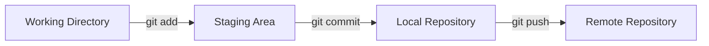

# Repository Basics

Before learning advanced Git features like branching and merging, it's important to understand how a Git repository works and how Git manages changes.

---

# What is a Repository?

A **repository** (or **repo**) is a directory that Git uses to store your project's files, history, and metadata.

Think of it as a project's home where Git keeps track of every change made over time.

There are two main types of repositories:

- **Local Repository** – Stored on your computer.
- **Remote Repository** – Hosted on platforms like GitHub, GitLab, or Bitbucket.

---

# Initialize a Repository

To create a new Git repository, navigate to your project folder and run:

```bash
git init
```

Example:

```bash
mkdir learning-lab
cd learning-lab
git init
```

Output:

```text
Initialized empty Git repository in /learning-lab/.git/
```

Git creates a hidden `.git` folder that stores all repository data, including commit history, branches, and configuration.

---

# Check Repository Status

Use the following command to check the current state of your repository:

```bash
git status
```

This command shows:

- Current branch
- Tracked files
- Untracked files
- Files staged for commit
- Files modified but not staged

---



### Working Directory

This is where you create, edit, and delete files.

Example:

```text
index.html
style.css
README.md
```

---

### Staging Area

The staging area is a temporary place where you prepare changes before committing them.

Add files to the staging area:

```bash
git add filename
```

Add all files:

```bash
git add .
```

---

### Local Repository

Once your changes are staged, save them permanently by creating a commit.

```bash
git commit -m "Your commit message"
```

A commit acts as a snapshot of your project at a specific point in time.

---

# Understanding File States

Git tracks files through different states.

| State | Description |
|--------|-------------|
| Untracked | Git is not tracking the file yet. |
| Tracked | Git knows about the file. |
| Modified | The tracked file has been changed. |
| Staged | The file is ready to be committed. |
| Committed | The changes have been saved in the repository. |

---

# Basic Git Commands

Initialize a repository:

```bash
git init
```

Check repository status:

```bash
git status
```

Stage a single file:

```bash
git add filename
```

Stage all files:

```bash
git add .
```

Create a commit:

```bash
git commit -m "Initial commit"
```

View commit history:

```bash
git log
```

View a simplified commit history:

```bash
git log --oneline
```

---

# Example Workflow

Create a new project.

```bash
mkdir demo-project
cd demo-project
git init
```

Create a file.

```bash
touch README.md
```

Check its status.

```bash
git status
```

Stage the file.

```bash
git add README.md
```

Commit the file.

```bash
git commit -m "Add README file"
```

View the commit history.

```bash
git log
```

---

# Best Practices

- Initialize Git before starting development.
- Commit small, meaningful changes.
- Write descriptive commit messages.
- Review changes using `git status` before committing.
- Keep related changes in the same commit.

---

# Common Mistakes

### Forgetting to stage files

Running `git commit` without staging changes won't include them in the commit.

Always check:

```bash
git status
```

---

### Using unclear commit messages

Avoid:

```text
Update
Fix
Changes
```

Prefer:

```text
Add login page
Fix navigation bar alignment
Update Git documentation
```

---

# Summary

In this chapter, you learned:

- What a Git repository is.
- The difference between local and remote repositories.
- How to initialize a repository.
- The Git workflow.
- File states in Git.
- Essential repository commands.
- Best practices for managing repositories.

---

## Next Chapter

➡️ **04 – Branching**