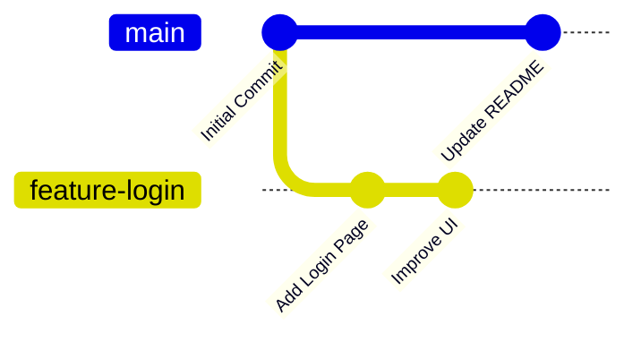

# Branching

Branching is one of Git's most powerful features. It allows developers to work on new features, fix bugs, or experiment with ideas without affecting the main project.

By using branches, multiple developers can work on different parts of a project simultaneously.

---

# What is a Branch?

A **branch** is an independent line of development in a Git repository.

When you create a branch, Git creates a new pointer to the current commit. Any new commits made on that branch remain separate until they are merged.

The default branch in most repositories is called **main**.

---

# Why Use Branches?

Branches help you:

- Develop new features safely.
- Fix bugs without affecting the main branch.
- Experiment with new ideas.
- Collaborate with multiple developers.
- Keep the main branch stable.

---

# How Branches Work



The diagram above shows two branches working independently.

---

# View Existing Branches

To see all local branches:

```bash
git branch
```

Example output:

```text
* main
  feature-login
```

The `*` indicates the currently active branch.

---

# Create a New Branch

Create a new branch:

```bash
git branch feature-login
```

This creates the branch but does not switch to it.

---

# Switch to a Branch

Move to another branch:

```bash
git switch feature-login
```

Or using the older command:

```bash
git checkout feature-login
```

---

# Create and Switch in One Command

```bash
git switch -c feature-login
```

Older alternative:

```bash
git checkout -b feature-login
```

---

# Rename a Branch

Rename the current branch:

```bash
git branch -m new-branch-name
```

---

# Delete a Branch

Delete a merged branch:

```bash
git branch -d feature-login
```

Force delete a branch:

```bash
git branch -D feature-login
```

Use force deletion carefully because it removes the branch even if it contains unmerged changes.

---

# List All Branches

Local branches:

```bash
git branch
```

Remote branches:

```bash
git branch -r
```

All branches:

```bash
git branch -a
```

---

# Best Practices

- Keep the `main` branch stable.
- Create a new branch for every feature or bug fix.
- Use meaningful branch names.
- Merge completed work back into the main branch.
- Delete branches after they are no longer needed.

---

# Common Branch Naming Conventions

| Branch Type | Example |
|-------------|---------|
| Feature | `feature/login-page` |
| Bug Fix | `bugfix/navbar` |
| Hotfix | `hotfix/payment-error` |
| Documentation | `docs/update-readme` |
| Refactor | `refactor/user-service` |

---

# Common Mistakes

### Working directly on `main`

Avoid making large changes directly on the main branch.

---

### Forgetting to switch branches

Always check your current branch:

```bash
git branch
```

or

```bash
git status
```

---

### Using unclear branch names

Avoid:

```text
new
test
abc
branch1
```

Prefer:

```text
feature/user-authentication
bugfix/login-error
docs/git-guide
```

---

# Summary

In this chapter, you learned:

- What a Git branch is.
- Why branches are useful.
- How to create, switch, rename, and delete branches.
- Common branch naming conventions.
- Best practices for working with branches.

---

## Next Chapter

➡️ **05 – Merging**