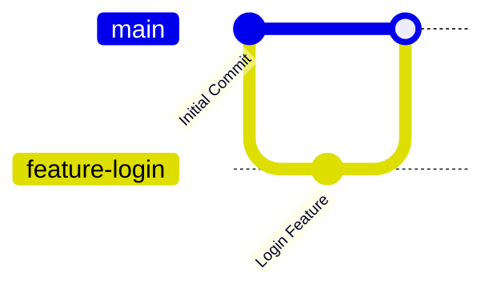

# Merging

After working on a separate branch, you'll often want to combine your changes with another branch. This process is called **merging**.

Git merges the history of two branches, allowing the changes from one branch to become part of another.

---

# Why Do We Merge?

Merging allows developers to:

- Integrate completed features into the main branch.
- Combine work from multiple developers.
- Keep the project up to date.
- Preserve the complete commit history.

---

# Basic Merge Workflow

1. Create a new branch.
2. Make changes and commit them.
3. Switch back to the target branch.
4. Merge the feature branch.

---

# Merge a Branch

Switch to the target branch (usually `main`):

```bash
git switch main
```

Merge another branch:

```bash
git merge feature-login
```

Git combines the changes from `feature-login` into `main`.

---

# Example

Create a feature branch:

```bash
git switch -c feature-login
```

Make your changes and commit them:

```bash
git add .
git commit -m "Add login feature"
```

Switch back to the main branch:

```bash
git switch main
```

Merge the feature branch:

```bash
git merge feature-login
```

---

# Merge Workflow



---

# Fast-Forward Merge

A **Fast-Forward Merge** occurs when the target branch has no new commits since the feature branch was created.

Git simply moves the branch pointer forward.

Example:

```bash
git merge feature-login
```

---

# Three-Way Merge

A **Three-Way Merge** happens when both branches have different commits.

Git creates a new merge commit to combine both histories.

---

# Merge Conflicts

A merge conflict occurs when Git cannot automatically determine which changes should be kept.

For example, if two developers edit the same line in the same file, Git will ask you to resolve the conflict manually.

---

# Resolve a Merge Conflict

1. Open the conflicted file.
2. Decide which changes to keep.
3. Remove the conflict markers.
4. Save the file.
5. Stage the resolved file.
6. Commit the merge.

Example:

```bash
git add .
git commit
```

---

# Best Practices

- Commit your changes before merging.
- Pull the latest changes before starting a merge.
- Keep feature branches focused on a single task.
- Resolve conflicts carefully.
- Delete branches after they are merged.

---

# Common Mistakes

### Merging into the Wrong Branch

Always check your current branch before merging.

```bash
git branch
```

---

### Ignoring Merge Conflicts

Never ignore conflict markers. Review the changes carefully before committing.

---

### Forgetting to Commit Before Merging

Uncommitted changes can complicate the merge process.

Check your repository status before merging:

```bash
git status
```

---

# Summary

In this chapter, you learned:

- What merging is.
- Why merging is important.
- How to merge branches.
- The difference between Fast-Forward and Three-Way merges.
- How to resolve merge conflicts.
- Best practices for merging branches.

---

## Next Chapter

➡️ **06 – Remote Repositories**