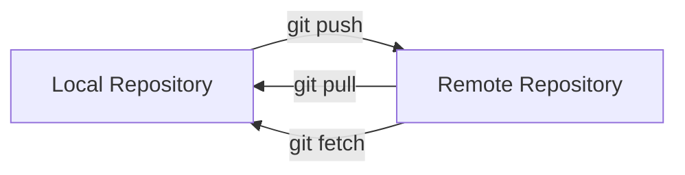

# Remote Repositories

A **remote repository** is a version of your Git repository that is hosted on a remote server. It allows developers to back up their work, collaborate with others, and synchronize changes across multiple machines.

Popular Git hosting platforms include **GitHub**, **GitLab**, and **Bitbucket**.

---

# Why Use Remote Repositories?

Remote repositories help you:

- Backup your code online.
- Collaborate with other developers.
- Access your projects from multiple devices.
- Share your work with the developer community.
- Contribute to open-source projects.

---

# Local vs Remote Repository

| Local Repository | Remote Repository |
|------------------|-------------------|
| Stored on your computer | Hosted on a server |
| Can be used offline | Requires an internet connection |
| Used for development | Used for collaboration and backup |

---

# Add a Remote Repository

To connect your local repository to a remote repository:

```bash
git remote add origin <repository-url>
```

Example:

```bash
git remote add origin https://github.com/username/learning-lab.git
```

---

# View Remote Repositories

Display all configured remote repositories:

```bash
git remote -v
```

Example output:

```text
origin  https://github.com/username/learning-lab.git (fetch)
origin  https://github.com/username/learning-lab.git (push)
```

---

# Push Changes to a Remote Repository

Upload your commits:

```bash
git push origin main
```

If it's your first push:

```bash
git push -u origin main
```

The `-u` option sets the upstream branch, allowing future pushes with just:

```bash
git push
```

---

# Fetch Changes

Download changes from the remote repository without merging them:

```bash
git fetch
```

---

# Pull Changes

Download and merge changes from the remote repository:

```bash
git pull
```

---

# Clone a Repository

Copy an existing remote repository to your computer:

```bash
git clone <repository-url>
```

Example:

```bash
git clone https://github.com/username/learning-lab.git
```

---

# Remove a Remote Repository

Remove an existing remote:

```bash
git remote remove origin
```

---

# Rename a Remote Repository

Rename a remote:

```bash
git remote rename origin upstream
```

---

# Remote Repository Workflow



---

# Best Practices

- Verify the remote URL before pushing.
- Pull the latest changes before starting work.
- Use meaningful commit messages.
- Keep your local repository synchronized with the remote repository.
- Protect important branches like `main`.

---

# Common Mistakes

### Pushing to the Wrong Repository

Always verify the configured remotes:

```bash
git remote -v
```

---

### Forgetting to Pull Before Pushing

If someone else has pushed changes, pulling first helps avoid conflicts.

```bash
git pull origin main
```

---

### Incorrect Repository URL

If the remote URL is incorrect, update it:

```bash
git remote set-url origin <new-url>
```

---

# Summary

In this chapter, you learned:

- What a remote repository is.
- The difference between local and remote repositories.
- How to add, view, rename, and remove remotes.
- How to push, pull, fetch, and clone repositories.
- Best practices for working with remote repositories.

---

## Next Chapter

➡️ **07 – GitHub Workflow**