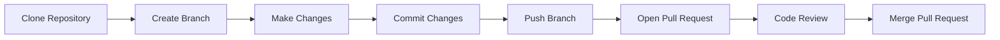

# GitHub Workflow

The GitHub workflow is a collaborative development process that allows developers to work on features, review code, and safely integrate changes into a project.

It is commonly used by individuals, teams, and open-source projects.

---

# What is the GitHub Workflow?

The GitHub workflow is based on the following steps:

1. Create or clone a repository.
2. Create a new branch.
3. Make changes.
4. Commit your changes.
5. Push the branch to GitHub.
6. Open a Pull Request.
7. Review the code.
8. Merge the Pull Request.
9. Delete the branch (optional).

---

# Typical Workflow



---

# Step 1: Clone a Repository

Download the repository to your computer.

```bash
git clone <repository-url>
```

Example:

```bash
git clone https://github.com/username/learning-lab.git
```

---

# Step 2: Create a Branch

Create and switch to a new branch.

```bash
git switch -c feature-login
```

---

# Step 3: Make Changes

Edit your project files.

Check the repository status:

```bash
git status
```

---

# Step 4: Stage and Commit Changes

Stage the changes:

```bash
git add .
```

Commit them:

```bash
git commit -m "Add login feature"
```

---

# Step 5: Push the Branch

Upload the branch to GitHub.

```bash
git push origin feature-login
```

---

# Step 6: Open a Pull Request

After pushing your branch:

- Open the repository on GitHub.
- Compare your branch with the `main` branch.
- Create a Pull Request (PR).
- Add a clear title and description.

---

# Step 7: Review Changes

Before merging:

- Review the code.
- Check for errors.
- Suggest improvements.
- Approve the Pull Request.

---

# Step 8: Merge the Pull Request

Once the Pull Request is approved:

- Click **Merge Pull Request**.
- Confirm the merge.
- The changes become part of the target branch.

---

# Step 9: Delete the Branch

After a successful merge, the feature branch can be deleted.

Delete it locally:

```bash
git branch -d feature-login
```

Delete it from GitHub:

```bash
git push origin --delete feature-login
```

---

# Pull Request Best Practices

- Keep Pull Requests focused on one feature or fix.
- Write meaningful titles and descriptions.
- Review your changes before submitting.
- Respond to review feedback.
- Avoid very large Pull Requests.

---

# Common Mistakes

### Working directly on the `main` branch

Create a feature branch before making changes.

---

### Skipping Code Reviews

Code reviews improve code quality and help identify issues early.

---

### Large Pull Requests

Smaller Pull Requests are easier to review and merge.

---

# Summary

In this chapter, you learned:

- What the GitHub workflow is.
- How to create and use feature branches.
- How to push changes to GitHub.
- How Pull Requests work.
- Best practices for collaborating with GitHub.

---

## Next Chapter

➡️ **08 – Git Commands**