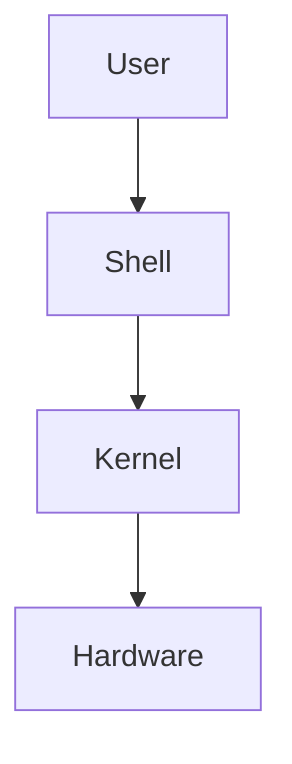

# Introduction to Linux

Linux is a free and open-source operating system based on the Unix operating system. It is widely used in servers, cloud computing, embedded systems, supercomputers, and software development due to its stability, security, and flexibility.

Created by **Linus Torvalds** in **1991**, Linux has grown into one of the most popular operating systems in the world.

---

# What is an Operating System?

An **Operating System (OS)** is system software that manages computer hardware and software resources while providing services for applications.

It acts as a bridge between the user and the computer's hardware.

Examples of operating systems include:

- Linux
- Windows
- macOS
- Android
- iOS

---

# Why Learn Linux?

Linux is an essential skill for developers, system administrators, and DevOps engineers.

Learning Linux helps you:

- Work efficiently using the command line.
- Manage servers and cloud environments.
- Automate tasks with shell scripts.
- Use development tools more effectively.
- Understand how operating systems work.

---

# Key Features of Linux

- Open-source and free to use.
- Multiuser operating system.
- Multitasking support.
- Strong security model.
- Highly customizable.
- Stable and reliable.
- Portable across different hardware platforms.

---

# Linux Distributions

A **Linux distribution (distro)** is an operating system built on the Linux kernel along with additional software and tools.

Some popular Linux distributions include:

| Distribution | Primary Use |
|--------------|-------------|
| Ubuntu | Beginners, Development |
| Debian | Stability and Servers |
| Fedora | Latest Features |
| Arch Linux | Advanced Users |
| Kali Linux | Cybersecurity and Penetration Testing |
| Linux Mint | Desktop Users |

---

# Linux Architecture

### Components

- **User** – Interacts with the operating system.
- **Shell** – Accepts user commands and communicates with the kernel.
- **Kernel** – The core of Linux that manages hardware and system resources.
- **Hardware** – Physical components such as CPU, memory, storage, and peripherals.

---

# Advantages of Linux

- Free and open-source.
- Excellent performance.
- Strong security.
- Reliable for servers.
- Large developer community.
- Supports a wide range of programming tools.

---

# Common Uses of Linux

Linux is widely used in:

- Software Development
- Cloud Computing
- Web Servers
- DevOps
- Cybersecurity
- Embedded Systems
- Supercomputers
- Android Operating System

---

# Common Linux Terminology

| Term | Description |
|------|-------------|
| Kernel | The core component of the operating system. |
| Shell | Command-line interface used to interact with Linux. |
| Terminal | Application used to access the shell. |
| Distribution | A complete Linux operating system built around the Linux kernel. |
| Root User | The administrator with full system privileges. |

---

# Best Practices

- Learn basic terminal commands before advanced topics.
- Practice commands in a safe environment.
- Read command documentation using `man`.
- Understand concepts instead of memorizing commands.

---

# Summary

In this chapter, you learned:

- What Linux is.
- What an operating system does.
- Why Linux is widely used.
- Key features of Linux.
- Popular Linux distributions.
- Basic Linux architecture.
- Common Linux terminology.

---

## Next Chapter

➡️ **02 – Linux File System**