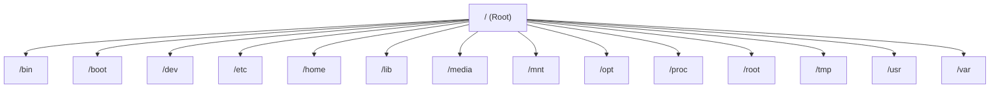

# Linux File System

The Linux file system organizes how files and directories are stored and managed. Unlike Windows, which uses separate drives such as `C:` and `D:`, Linux has a **single directory tree** that starts from the **root directory (`/`)**.

Everything in Linux, including files, directories, storage devices, and system resources, is organized under this hierarchy.

---

# Root Directory (`/`)

The **root directory (`/`)** is the top-level directory of the Linux file system.

All other files and directories originate from this directory.

```text
/
```

---

# Linux Directory Structure



---

# Important Directories

| Directory | Purpose |
|-----------|---------|
| `/` | Root directory containing all files and directories. |
| `/bin` | Essential user commands and executable programs. |
| `/boot` | Boot loader files and Linux kernel. |
| `/dev` | Device files representing hardware devices. |
| `/etc` | System configuration files. |
| `/home` | Home directories for regular users. |
| `/lib` | Essential shared libraries. |
| `/media` | Automatically mounted removable devices. |
| `/mnt` | Temporary mount point for file systems. |
| `/opt` | Optional third-party software packages. |
| `/proc` | Virtual filesystem containing process and system information. |
| `/root` | Home directory of the root user. |
| `/tmp` | Temporary files. |
| `/usr` | User applications and utilities. |
| `/var` | Variable data such as logs and cache files. |

---

# Home Directory

Each user has a personal home directory.

Example:

```text
/home/john
```

or

```text
/home/somya
```

This directory stores personal files, downloads, documents, and user-specific configuration files.

---

# Current Working Directory

The current working directory is the directory you are currently using in the terminal.

Display it using:

```bash
pwd
```

Example output:

```text
/home/somya/Documents
```

---

# Absolute Path

An **absolute path** starts from the root directory (`/`).

Example:

```text
/home/somya/Documents/project
```

Absolute paths always begin with `/`.

---

# Relative Path

A **relative path** starts from the current working directory.

Example:

```text
Documents/project
```

Relative paths do not begin with `/`.

---

# Special Directory Symbols

| Symbol | Meaning |
|---------|---------|
| `.` | Current directory |
| `..` | Parent directory |
| `~` | Home directory |
| `/` | Root directory |

Examples:

```bash
cd .
cd ..
cd ~
cd /
```

---

# View Directory Contents

Display files and directories:

```bash
ls
```

Display detailed information:

```bash
ls -l
```

Display hidden files:

```bash
ls -a
```

---

# Best Practices

- Use absolute paths when writing scripts.
- Organize files inside your home directory.
- Avoid modifying system directories unless necessary.
- Learn the purpose of common Linux directories.
- Use `pwd` frequently to know your current location.

---

# Common Mistakes

### Confusing `/` and `~`

- `/` refers to the root directory.
- `~` refers to the current user's home directory.

---

### Deleting Files from System Directories

Avoid modifying directories like:

```text
/bin
/etc
/lib
```

unless you understand their purpose.

---

# Summary

In this chapter, you learned:

- The Linux file system hierarchy.
- The purpose of important directories.
- The difference between absolute and relative paths.
- Special directory symbols.
- How to view your current location and list directory contents.

---

## Navigation

⬅️ Previous: [Introduction to Linux](01-Introduction-to-Linux.md)

➡️ Next: [Basic Commands](03-Basic-Commands.md)