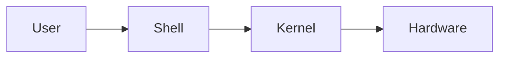

# Shell and Bash

A **shell** is a program that allows users to interact with an operating system by entering commands.

**Bash (Bourne Again SHell)** is one of the most widely used shells on Linux systems.

---

# What is a Shell?

The shell acts as an interface between the user and the operating system.

It receives commands from the user, interprets them, and asks the operating system to perform the requested operation.



---

# What is Bash?

Bash stands for **Bourne Again SHell**.

It is both:

- A command-line shell.
- A scripting language.

Bash can be used to run commands interactively and automate repetitive tasks using scripts.

---

# Common Linux Shells

| Shell | Description |
|-------|-------------|
| Bash | Common default shell on many Linux distributions. |
| Zsh | Interactive shell with advanced customization features. |
| Fish | User-friendly shell with helpful interactive features. |
| Sh | Traditional Unix shell and shell scripting interface. |

---

# Check the Current Shell

Display the current user's default shell:

```bash
echo $SHELL
```

Example output:

```text
/bin/bash
```

You can also check the shell process:

```bash
ps -p $$
```

---

# Command Line Basics

Commands generally follow this structure:

```text
command [options] [arguments]
```

Example:

```bash
ls -l Documents
```

Here:

- `ls` → Command
- `-l` → Option
- `Documents` → Argument

---

# Environment Variables

Environment variables store information that can be accessed by processes and programs.

Display a variable:

```bash
echo $HOME
```

Example output:

```text
/home/somya
```

Display the current username:

```bash
echo $USER
```

Display the current working directory:

```bash
echo $PWD
```

---

# Create an Environment Variable

Create a shell variable:

```bash
name="Linux"
```

Access it:

```bash
echo $name
```

Output:

```text
Linux
```

To make a variable available to child processes, export it:

```bash
export name="Linux"
```

---

# Command Substitution

Command substitution allows the output of a command to be used as part of another command.

Modern syntax:

```bash
echo "Current directory: $(pwd)"
```

Example output:

```text
Current directory: /home/somya
```

---

# Aliases

An alias creates a shortcut for a command.

Create an alias:

```bash
alias ll="ls -la"
```

Now:

```bash
ll
```

runs:

```bash
ls -la
```

List aliases:

```bash
alias
```

> 📌 **Note:** A temporary alias usually lasts only for the current shell session. To make an alias persistent, add it to your shell configuration file such as `~/.bashrc`.

---

# Shell Configuration

Bash configuration for an interactive non-login shell is commonly stored in:

```text
~/.bashrc
```

After modifying the file, reload it:

```bash
source ~/.bashrc
```

---

# Command History

Bash keeps a history of previously executed commands.

View the history:

```bash
history
```

Search command history interactively:

```text
Ctrl + R
```

Run a previous command by its history number:

```bash
!25
```

---

# Useful Bash Shortcuts

| Shortcut | Purpose |
|----------|---------|
| `Ctrl + C` | Stop the current command |
| `Ctrl + L` | Clear the terminal |
| `Ctrl + D` | Exit the current shell |
| `Ctrl + R` | Search command history |
| `Tab` | Auto-complete commands and paths |
| `↑` / `↓` | Navigate command history |

---

# Shell vs Terminal

These terms are related but different.

| Terminal | Shell |
|----------|-------|
| Application used to access the command line | Program that interprets commands |
| Provides the interface/window | Executes commands |
| Example: GNOME Terminal | Example: Bash |

---

# Check Available Shells

Linux stores commonly available shells in:

```bash
cat /etc/shells
```

Example output:

```text
/bin/sh
/bin/bash
/bin/zsh
```

---

# Best Practices

- Use meaningful variable names.
- Quote variables when they may contain spaces.
- Avoid modifying system-wide shell configuration unless necessary.
- Use `Ctrl + R` to quickly find previous commands.
- Learn Bash gradually before writing complex scripts.
- Be careful when executing commands copied from unknown sources.

---

# Common Mistakes

### Forgetting `$` When Reading Variables

Correct:

```bash
name="Linux"
echo $name
```

Incorrect:

```bash
echo name
```

---

### Spaces Around `=`

Bash variable assignment does not allow spaces around `=`.

Correct:

```bash
name="Linux"
```

Incorrect:

```bash
name = "Linux"
```

---

### Confusing Shell and Terminal

A terminal is the interface you use to access a shell. Bash is the program interpreting your commands.

---

# Summary

In this chapter, you learned:

- What a shell is.
- What Bash is.
- Common Linux shells.
- How to work with environment variables.
- Command substitution.
- Aliases and Bash configuration.
- Command history and useful keyboard shortcuts.
- The difference between a terminal and a shell.

---

## Navigation

⬅️ Previous: [Package Management](07-Package-Management.md)

➡️ Next: [Process Management](09-Process-Management.md)