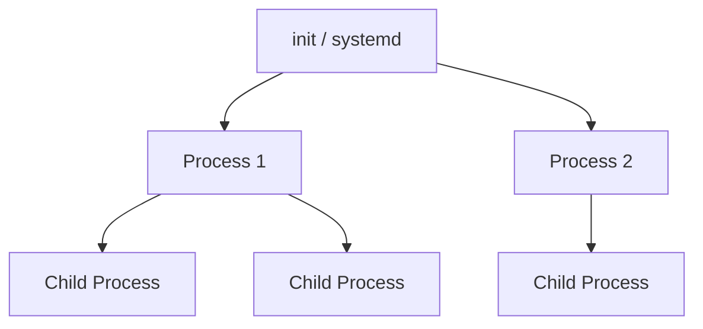

# Process Management

A **process** is a running instance of a program. Whenever you execute a command or start an application, Linux creates a process to perform that task.

Linux provides several commands for viewing, monitoring, and managing processes.

---

# What is a Process?

A process contains information such as:

- Process ID (PID)
- User who started the process
- CPU usage
- Memory usage
- Current state
- Parent process

Each running process has a unique **Process ID (PID)**.

---

# Process Hierarchy

Processes can create other processes, forming a parent-child relationship.



> 📌 **Note:** On most modern Linux distributions, `systemd` is the first userspace process and normally has PID 1.

---

# View Running Processes

Use `ps` to display information about running processes.

```bash
ps
```

Display processes for all users:

```bash
ps aux
```

Display processes in a tree structure:

```bash
pstree
```

---

# Process Information

A typical `ps aux` output looks like:

```text
USER       PID %CPU %MEM    VSZ   RSS TTY      STAT START   TIME COMMAND
somya     1245  0.2  1.1 123456 12345 pts/0    S+   18:30   0:00 bash
somya     1350  0.0  0.5  45678  5678 pts/0    R+   18:31   0:00 ps aux
```

Important columns:

| Column | Meaning |
|--------|---------|
| `USER` | User who owns the process |
| `PID` | Process ID |
| `%CPU` | CPU usage |
| `%MEM` | Memory usage |
| `STAT` | Process state |
| `COMMAND` | Command that started the process |

---

# Monitor Processes in Real Time

The `top` command displays processes and system resource usage in real time.

```bash
top
```

Exit `top` with:

```text
q
```

---

# Find a Process

Search for a process by name:

```bash
pgrep firefox
```

Another option is:

```bash
ps aux | grep firefox
```

> 💡 **Tip:** `pgrep` is generally cleaner when you simply want the PID of a process matching a name.

---

# Run a Process in the Background

Add `&` to run a command in the background.

```bash
sleep 60 &
```

Linux will return a process ID similar to:

```text
[1] 2456
```

Here, `2456` is the PID.

---

# View Background Jobs

```bash
jobs
```

---

# Bring a Job to the Foreground

```bash
fg
```

Bring a specific job to the foreground:

```bash
fg %1
```

---

# Send a Process to the Background

If a process is currently running in the foreground:

1. Press:

```text
Ctrl + Z
```

2. Then run:

```bash
bg
```

---

# Terminate a Process

The `kill` command sends a signal to a process.

```bash
kill 2456
```

The default signal is `SIGTERM`, which asks the process to terminate gracefully.

---

# Forcefully Terminate a Process

If a process does not respond to a normal termination request:

```bash
kill -9 2456
```

> ⚠️ **Warning:** `SIGKILL` (`-9`) immediately terminates the process and does not allow it to perform cleanup. Use it only when necessary.

---

# Kill a Process by Name

```bash
pkill firefox
```

---

# Process Signals

Linux uses signals to communicate with processes.

| Signal | Number | Purpose |
|--------|-------:|---------|
| `SIGTERM` | 15 | Request graceful termination |
| `SIGKILL` | 9 | Force immediate termination |
| `SIGSTOP` | 19* | Stop a process |
| `SIGCONT` | 18* | Continue a stopped process |

\*Signal numbers can vary between architectures.

---

# Check Process Priority

Linux assigns processes a scheduling priority.

View priority information:

```bash
ps -eo pid,ni,comm
```

The `NI` column represents the **nice value**.

---

# Change Process Priority

Start a command with a specific nice value:

```bash
nice -n 10 command
```

Change the priority of an existing process:

```bash
renice 10 -p 2456
```

> 📌 **Note:** Nice values generally range from `-20` (higher priority) to `19` (lower priority).

---

# Command Summary

| Command | Purpose |
|---------|---------|
| `ps` | Display processes |
| `ps aux` | Display processes for all users |
| `top` | Monitor processes in real time |
| `pstree` | Display process hierarchy |
| `pgrep` | Find processes by name |
| `kill` | Send a signal to a process |
| `pkill` | Send a signal to processes by name |
| `jobs` | Display shell background jobs |
| `fg` | Bring a job to the foreground |
| `bg` | Resume a stopped job in the background |
| `nice` | Start a process with a specific priority |
| `renice` | Change the priority of a running process |

---

# Best Practices

- Check the PID before terminating a process.
- Prefer `SIGTERM` before using `SIGKILL`.
- Avoid killing system processes unless you know their purpose.
- Use `top` or `ps` to investigate high resource usage.
- Use process priorities carefully.

---

# Common Mistakes

### Using `kill -9` Immediately

Try a normal termination first:

```bash
kill PID
```

Use:

```bash
kill -9 PID
```

only if the process refuses to terminate.

---

### Killing the Wrong Process

Always verify the PID before sending a signal:

```bash
ps -p PID
```

---

### Confusing Jobs and Processes

Shell jobs are commands managed by your current shell, while processes are operating-system-level running programs.

---

# Summary

In this chapter, you learned:

- What a Linux process is.
- How processes are identified using PIDs.
- How to view and monitor processes.
- How to run processes in the background.
- How to stop and terminate processes.
- How Linux signals work.
- How to manage process priorities.

---

## Navigation

⬅️ Previous: [Shell and Bash](08-Shell-and-Bash.md)

➡️ Next: [Networking Commands](10-Networking-Commands.md)