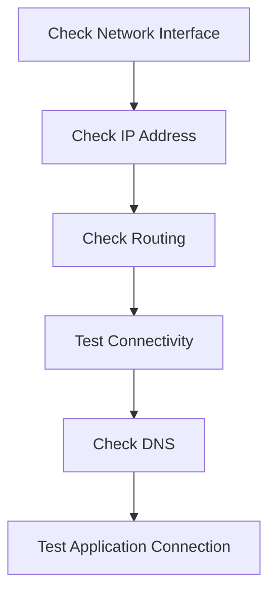

# Networking Commands

Linux provides several command-line tools for inspecting network connections, testing connectivity, resolving domain names, and transferring data.

Understanding these commands is useful when troubleshooting networks, servers, and cloud environments.

---

# View Network Interfaces

The `ip` command is used to view and manage network interfaces.

Display network interfaces:

```bash
ip addr
```

A shorter form:

```bash
ip a
```

Example output:

```text
2: eth0:
    inet 192.168.1.10/24
```

---

# View Routing Information

Display the system's routing table:

```bash
ip route
```

Example:

```text
default via 192.168.1.1 dev eth0
192.168.1.0/24 dev eth0
```

The default route determines where traffic is sent when there is no more specific route.

---

# Test Network Connectivity

The `ping` command tests whether a host is reachable over a network.

```bash
ping google.com
```

Stop the command with:

```text
Ctrl + C
```

Limit the number of requests:

```bash
ping -c 4 google.com
```

> 💡 **Tip:** A failed `ping` does not always mean that a host is unreachable. Some systems or firewalls block ICMP traffic.

---

# Check DNS Resolution

DNS converts domain names into IP addresses.

Use:

```bash
nslookup google.com
```

Another commonly used command is:

```bash
dig google.com
```

> 📌 **Note:** `dig` may need to be installed separately on some Linux distributions.

---

# Display Open Network Connections

The `ss` command displays network sockets and connections.

Display listening TCP and UDP ports:

```bash
ss -tuln
```

Display established connections:

```bash
ss -t
```

Common options:

| Option | Meaning |
|--------|---------|
| `-t` | TCP |
| `-u` | UDP |
| `-l` | Listening sockets |
| `-n` | Show numerical addresses and ports |

---

# Test a Web Server

The `curl` command transfers data to or from a URL.

Make a simple HTTP request:

```bash
curl https://example.com
```

Display only the HTTP headers:

```bash
curl -I https://example.com
```

Check whether a website responds:

```bash
curl -I https://google.com
```

---

# Download Files

The `wget` command can download files from the internet.

```bash
wget https://example.com/file.zip
```

Save a file with a specific name:

```bash
wget -O download.zip https://example.com/file.zip
```

---

# Trace the Network Path

`traceroute` shows the network hops between your computer and a destination.

```bash
traceroute google.com
```

> 📌 **Note:** Some systems may require you to install `traceroute` first.

---

# Check the Hostname

Display the system's hostname:

```bash
hostname
```

Display detailed hostname information:

```bash
hostnamectl
```

---

# Check a Website's IP Address

You can use DNS tools to find the IP address associated with a domain.

```bash
nslookup example.com
```

You can also use:

```bash
dig example.com
```

---

# Basic Networking Workflow

When troubleshooting a network connection, you can follow a simple process:



Example:

```bash
ip a
ip route
ping 8.8.8.8
nslookup google.com
curl -I https://google.com
```

---

# Command Summary

| Command | Purpose |
|---------|---------|
| `ip a` | Display network interfaces and IP addresses |
| `ip route` | Display routing information |
| `ping` | Test network connectivity |
| `nslookup` | Query DNS information |
| `dig` | Perform detailed DNS queries |
| `ss` | Display network sockets and connections |
| `curl` | Transfer data using URLs |
| `wget` | Download files |
| `traceroute` | Trace the network path |
| `hostname` | Display the system hostname |
| `hostnamectl` | Display or manage hostname information |

---

# Best Practices

- Use `ip` instead of older networking tools when possible.
- Verify the destination before downloading files.
- Use `curl -I` to quickly inspect HTTP response headers.
- Check DNS separately when troubleshooting website connectivity.
- Avoid exposing sensitive network information unnecessarily.

---

# Common Mistakes

### Assuming `ping` Always Works

A server may be reachable even when it does not respond to ICMP requests.

---

### Confusing IP Address and Port

An IP address identifies a network interface or host, while a port identifies a service on that host.

Example:

```text
192.168.1.10:8080
```

Here:

```text
192.168.1.10 → IP address
8080         → Port
```

---

### Using the Wrong Protocol

Different services use different protocols and ports. For example, HTTPS normally uses TCP port `443`.

---

# Summary

In this chapter, you learned:

- How to view network interfaces and IP addresses.
- How to inspect routing information.
- How to test network connectivity.
- How to query DNS.
- How to inspect network connections and ports.
- How to test HTTP services.
- How to download files.
- How to trace network paths.

---

## Navigation

⬅️ Previous: [Process Management](09-Process-Management.md)

➡️ Next: [Redirection and Pipes](11-Redirection-and-Pipes.md)