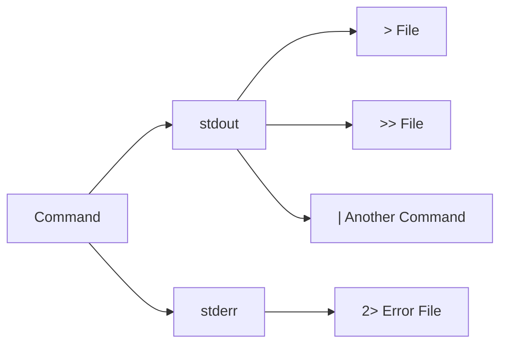

# Redirection and Pipes

Linux commands normally receive input from the keyboard and send their output to the terminal. **Redirection** allows you to change where input comes from or where output goes.

**Pipes** allow the output of one command to become the input of another command.

---

# Standard Input, Output, and Error

Linux commonly works with three standard streams:

| Stream | Name | File Descriptor |
|--------|------|----------------:|
| `stdin` | Standard Input | `0` |
| `stdout` | Standard Output | `1` |
| `stderr` | Standard Error | `2` |

The terminal normally provides input through `stdin` and displays both `stdout` and `stderr`.

---

# Output Redirection

The `>` operator redirects command output to a file.

```bash
ls > files.txt
```

If `files.txt` does not exist, it is created.

If it already exists, its contents are **overwritten**.

> ⚠️ **Warning:** Using `>` on an existing file replaces its previous contents.

---

# Append Output

The `>>` operator adds output to the end of a file.

```bash
echo "Hello Linux" >> notes.txt
```

Unlike `>`, it does not overwrite the existing contents.

Example:

```bash
echo "First line" > notes.txt
echo "Second line" >> notes.txt
```

The file will contain:

```text
First line
Second line
```

---

# Input Redirection

The `<` operator takes input from a file instead of the keyboard.

Example:

```bash
sort < names.txt
```

The contents of `names.txt` are provided as input to `sort`.

---

# Redirect Standard Error

Use `2>` to redirect error messages.

```bash
ls missing-file 2> error.txt
```

The error message is saved in `error.txt`.

---

# Redirect Output and Errors

Redirect standard output:

```bash
command > output.txt
```

Redirect standard error:

```bash
command 2> error.txt
```

Redirect both:

```bash
command > output.txt 2>&1
```

A common Bash shorthand is:

```bash
command &> output.txt
```

---

# Discard Output

Linux provides `/dev/null`, which discards anything sent to it.

Discard standard output:

```bash
command > /dev/null
```

Discard standard error:

```bash
command 2> /dev/null
```

Discard both:

```bash
command > /dev/null 2>&1
```

---

# What is a Pipe?

The pipe operator `|` sends the output of one command directly into another command.

Basic structure:

```text
command1 | command2
```

Example:

```bash
ls | grep ".txt"
```

Here:

1. `ls` produces a list of files.
2. `|` sends that output to `grep`.
3. `grep` displays matching `.txt` entries.

---

# Multiple Pipes

You can connect multiple commands together.

```bash
cat names.txt | sort | uniq
```

The output flows through each command:

```text
cat → sort → uniq
```

---

# Common Pipe Examples

Count the number of files:

```bash
ls | wc -l
```

Find a specific process:

```bash
ps aux | grep firefox
```

Search command history:

```bash
history | grep git
```

Display the first few lines:

```bash
ls -l | head
```

Sort files:

```bash
ls | sort
```

---

# Pipe vs Redirection

| Feature | Pipe `|` | Redirection `>` |
|---------|-----------|-----------------|
| Purpose | Connect commands | Send output to a file |
| Example | `ls \| grep txt` | `ls > files.txt` |
| Output destination | Another command | File |
| Common use | Command combinations | Saving output |

---

# Tee Command

The `tee` command sends output to both the terminal and a file.

```bash
echo "Hello Linux" | tee output.txt
```

Append instead of overwrite:

```bash
echo "Another line" | tee -a output.txt
```

---

# Practical Workflow

A common Linux workflow is:

```bash
command → filter → sort → save
```

For example:

```bash
ps aux | grep python | sort > processes.txt
```

This:

1. Lists running processes.
2. Filters processes containing `python`.
3. Sorts the results.
4. Saves the output to `processes.txt`.

---

# Redirection Flow



---

# Common Operators

| Operator | Purpose |
|----------|---------|
| `>` | Redirect output and overwrite a file |
| `>>` | Redirect output and append to a file |
| `<` | Read input from a file |
| `2>` | Redirect standard error |
| `2>&1` | Redirect stderr to stdout |
| `\|` | Pipe output into another command |
| `&>` | Redirect stdout and stderr |
| `/dev/null` | Discard output |

---

# Best Practices

- Use `>` carefully because it overwrites files.
- Use `>>` when you want to preserve existing content.
- Use pipes to build efficient command combinations.
- Redirect errors when troubleshooting scripts or commands.
- Use `/dev/null` only when you intentionally want to discard output.

---

# Common Mistakes

### Confusing `>` and `>>`

```bash
echo "New" > file.txt
```

Overwrites the file.

```bash
echo "New" >> file.txt
```

Appends to the file.

---

### Forgetting the Pipe Symbol

Incorrect:

```bash
ls grep txt
```

Correct:

```bash
ls | grep txt
```

---

### Accidentally Overwriting a File

Before using:

```bash
command > file.txt
```

make sure you don't need the existing contents of `file.txt`.

---

# Summary

In this chapter, you learned:

- Standard input, output, and error.
- Output and input redirection.
- The difference between `>` and `>>`.
- How to redirect errors.
- How pipes connect commands.
- How to use `tee`.
- How to combine multiple commands.

---

## Navigation

⬅️ Previous: [Networking Commands](10-Networking-Commands.md)

➡️ Next: [Bash Scripting](12-Bash-Scripting.md)